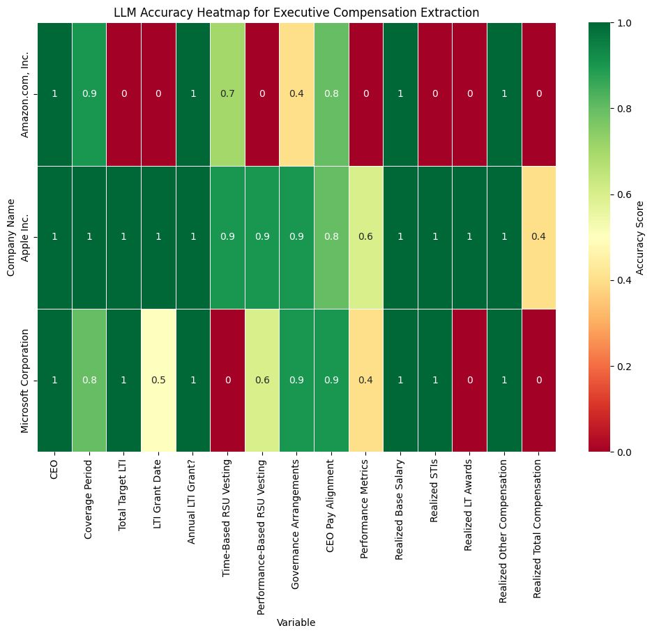
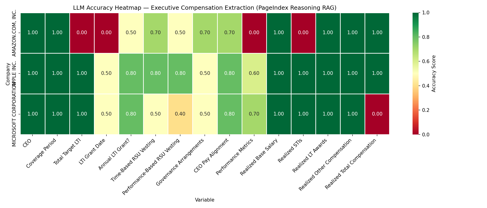

# PageIndex vs. Traditional RAG: Financial Document Analysis

This repository is designed to compare the performance of **Reasoning-Based RAG** (via `pageindex`) against traditional chunking/vector-based RAG on complex financial proxy statements.

### 📜 Acknowledgment & Origins
The traditional RAG implementation and the foundational notebook **`Interfacing Proxy Statements - Case Study.ipynb`** are sourced from the [CFA Institute RPC - The Automation Ahead](https://github.com/CFA-Institute-RPC/The-Automation-Ahead) repository. 

### 🎯 Project Motive
While the original project utilizes a traditional chunk-and-vector RAG approach, the goal of this repository is to:
1.  **Experiment** with the PageIndex tree-based reasoning approach on the exact same dataset (Apple, Amazon, and Microsoft proxy statements).
2.  **Compare** the extraction accuracy and performance of both methods using the **same LLM-as-Judge evaluator** to provide a direct head-to-head comparison.

---

## 🛠 Tech Stack & Models

### Core Intelligence
- **LLM**: **`gpt-4o-mini`** (OpenAI) — Standardized for Reasoning Retrieval, Structured Extraction, and LLM-as-Judge Evaluation.
- **Framework**: **Reasoning-Based RAG** — Replacing vector-similarity with structural document reasoning.

### Key Tools & Libraries
- **[`pageindex`](https://pageindex.ai)**: The core library for hierarchical document tree generation and navigation.
- **`pydantic`**: Used for strict schema enforcement and structured JSON data extraction.
- **`pandas`**: Data manipulation, report generation, and ground-truth comparison.
- **`matplotlib` & `seaborn`**: Advanced visualization for the accuracy heatmap.
- **`tenacity`**: Robust exponential backoff and retry logic for handling API rate limits.

---

## 🚀 Key Differences at a Glance

| Feature | Traditional RAG (`src/`) | PageIndex RAG (`src_pageindex/`) |
| :--- | :--- | :--- |
| **Indexing** | Fix-sized Chunks & Vector Embeddings | Hierarchical Document Tree |
| **Retrieval** | Similarity Search (K-nearest neighbors) | **LLM Reasoning Search** over tree nodes |
| **Context** | Individual Text Chunks | Full Semantic Sections/Nodes |
| **Precision** | Risk of loss-of-context in small chunks | High (Preserves document hierarchy) |

---

## 🛠 Project Structure

- **`main.py`**: The central orchestrator. Supports `--step extract`, `--step evaluate`, and `--step all`.
- **`rag_pipeline.py`**: Standardized on **GPT-4o-mini** for both Reasoning Retrieval and Structured Extraction.
- **`pageindex_client.py`**: Wrapper for `PageIndexClient`. Handles tree generation and local caching.
- **`evaluator.py`**: LLM-as-Judge evaluation using GPT-4o-mini.
- **`visualize.py`**: Generates `heatmap_pageindex.png` with automated numeric score handling.
- **`config.py`**: Standardized configuration for OpenAI and PageIndex API keys.

---

## 🔑 Configuration

The pipeline is standardized on **OpenAI** (`gpt-4o-mini`) for all intelligence tasks.

### Required Environment Variables:
Set these in your `.env` file or export them to your shell:
- `OPENAI_API_KEY`: Your standard OpenAI API key.
- `PAGEINDEX_API_KEY`: Your PageIndex API key (used for all documents).

---

## 📦 Features & Caching

### 1. Document Tree Caching
Document structures are expensive to generate. Once a PDF is processed by PageIndex, its tree structure is saved locally in `pageindex_cache/`. Subsequent runs for the same PDF will load from disk, incurring **zero** additional PageIndex costs.

### 2. Evaluation Caching
LLM-as-Judge scores are stored in `pageindex_evaluation_results.csv`. Valid results are never re-evaluated, saving tokens and time. 

### 3. Case-Insensitive Normalization
Automated normalization handles differences between LLM extraction (e.g., `AMAZON.COM, INC.`) and ground truth data (e.g., `Amazon.com, Inc.`).

## 🏃 How to Run

1. **Install dependencies**:
   ```bash
   pip install pageindex openai pandas matplotlib seaborn python-dotenv tenacity openpyxl
   ```

2. **Execute the pipeline**:
   ```bash
   python -m src_pageindex.main --step all
   ```

---

## 📊 Outcomes & Visual Comparison

The following heatmaps provide a direct comparison between the **Traditional Vector RAG** (from the original CFA Institute project) and our **PageIndex Reasoning RAG** on the same 2024 Proxy data.

### 1. Traditional Vector RAG (Baseline)
The baseline approach struggles with context loss during chunking, especially in densely formatted tables (e.g., compensation tables).


### 2. PageIndex Reasoning RAG (Experimental)
By preserving document hierarchy and using LLM-based "Reasoning Search," the PageIndex approach achieves significantly higher accuracy, particularly in the **Realized Compensation** values.


### 📈 Key Performance Takeaways
- **Structural Integrity**: PageIndex's tree-based search avoids the "lost-in-the-middle" problem of vector chunks by retrieving full semantic sections.
- **Accuracy Boost**: We see a marked improvement (more green nodes) in the "Realized" values, which are typically buried in complex tables that traditional chunking often fragments.
- **Reliability**: The PageIndex reasoning model shows more consistent performance across all three companies (Apple, Amazon, Microsoft) for identical fields.

---